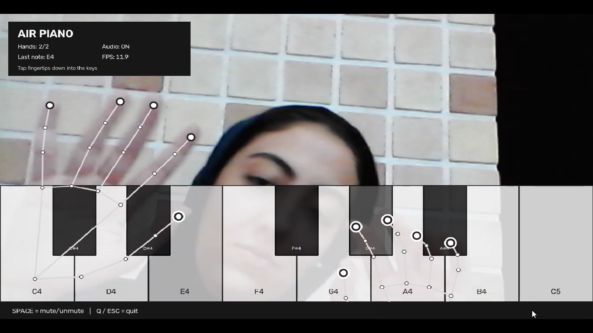

# AirPiano

AirPiano is a small computer vision project that turns a webcam into a simple virtual piano.

The idea is straightforward: the camera tracks your hands, the piano keys are drawn on the video, and when one of your fingertips moves onto a key, that note is played.

I built it with Python, OpenCV, MediaPipe and sounddevice.

## Demo



## What it does

- Tracks up to two hands at the same time
- Detects all five fingertips on each hand
- Draws a virtual piano over the webcam feed
- Plays white and black piano notes
- Supports multiple notes at the same time
- Highlights a key when it is played
- Shows the last played note and current FPS
- Lets you mute/unmute the sound with the keyboard

The current keyboard contains:

```text
White keys:
C4  D4  E4  F4  G4  A4  B4  C5

Black keys:
C#4  D#4  F#4  G#4  A#4
```

## How it works

MediaPipe gives the position of 21 landmarks for each detected hand.

AirPiano mainly uses the fingertip landmarks:

```text
Thumb
Index
Middle
Ring
Little
```

For every fingertip, the program checks its current position, previous position and the piano key underneath it.

When a finger moves into a new key, the note is played. A downward movement can also trigger the same key again after a short delay.

The basic flow is:

```text
                                                    Webcam
                                                      |
                                                      v
                                                    Hand detection
                                                      |
                                                      v
                                                    Hand landmarks
                                                      |
                                                      v
                                                    Fingertip positions
                                                      |
                                                      v
                                                    Virtual piano keys
                                                      |
                                                      v
                                                    Note detection
                                                      |
                                                      v
                                                    Audio output
```

## Sound

The project currently generates the sound directly instead of using recorded piano samples.

Each note has its own audio voice, so more than one note can be active at the same time.

The sound is made from a few sine-wave harmonics with a short attack and decay. It is not meant to sound exactly like an acoustic piano, but it keeps the project lightweight and does not require extra audio files.

## Installation

Clone the repository:

```bash
git clone https://github.com/MahnoushSefidabian/air-piano.git
cd air-piano
```

Create a virtual environment:

```powershell
py -3.9 -m venv .venv
```

Activate it on Windows:

```powershell
.\.venv\Scripts\Activate.ps1
```

Install the dependencies:

```powershell
python -m pip install -r requirements.txt
```

If `python` is not available as a command on Windows, you can also use:

```powershell
& ".\.venv\Scripts\python.exe" -m pip install -r requirements.txt
```

## Run

```powershell
python main.py
```

or:

```powershell
& ".\.venv\Scripts\python.exe" .\main.py
```

The MediaPipe hand model is downloaded automatically the first time the program runs.

## Controls

| Input | Action |
|---|---|
| Fingertip on a key | Play note |
| Multiple fingers | Play multiple notes |
| `Space` | Mute / unmute |
| `Q` | Quit |
| `Esc` | Quit |

## Project structure

```text
AirPiano/
├── main.py
├── requirements.txt
├── README.md
├── .gitignore
├── LICENSE
├── assets/
└── models/
```

## Built with

- Python
- OpenCV
- MediaPipe
- NumPy
- sounddevice

## Current limitations

This is still an experimental project.

Hand tracking can become less accurate when the lighting is poor, fingers overlap, or the hands move very quickly.

The piano also works in 2D image space. It estimates a key press from fingertip movement in the camera image rather than measuring real physical contact.

The generated sound is synthetic rather than a recorded piano.

## Things I want to improve

Some ideas for later versions:

- use real piano samples
- improve finger press detection
- add more octaves
- add hand calibration
- add sensitivity controls
- support MIDI output
- record performances
- experiment with depth-based finger movement

